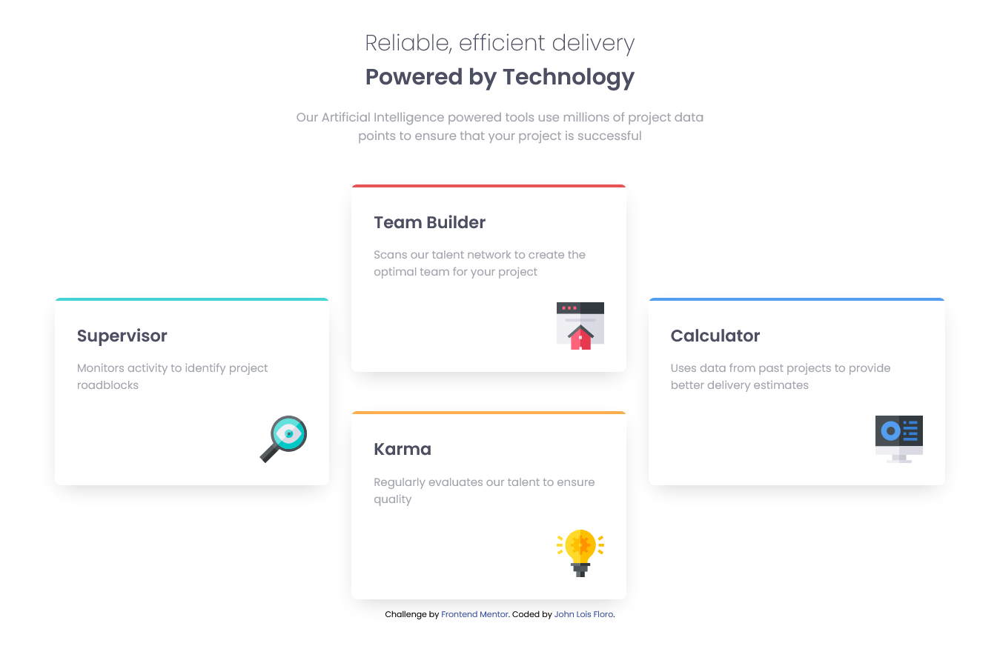

# Frontend Mentor - Four card feature section solution

This is a solution to the [Four card feature section challenge on Frontend Mentor](https://www.frontendmentor.io/challenges/four-card-feature-section-weK1eFYK). Frontend Mentor challenges help you improve your coding skills by building realistic projects.

## Table of contents

- [Overview](#overview)
  - [The challenge](#the-challenge)
  - [Screenshot](#screenshot)
  - [Links](#links)
- [My process](#my-process)
  - [Built with](#built-with)
  - [What I learned](#what-i-learned)
  - [Continued development](#continued-development)
  - [Useful resources](#useful-resources)
- [Author](#author)
- [Acknowledgments](#acknowledgments)

**Note: Delete this note and update the table of contents based on what sections you keep.**

## Overview

### The challenge

Users should be able to:

- View the optimal layout for the site depending on their device's screen size

### Screenshot



### Links

- Solution URL: [Add solution URL here](https://your-solution-url.com)
- Live Site URL: [Add live site URL here](https://your-live-site-url.com)

## My process

### Built with

- Semantic HTML5 markup
- CSS custom properties
- CSS Grid
- Mobile-first workflow
- SCSS Module System
- BEM Methodology
- Box-shadow Generator

### What I learned

I've learned a lot on this project specifically with grids and the new module system of SASS. I also applied some of the HTML5 Semantic elements such as picture tag, section tag, header and others.

To see how you can add code snippets, see below:

```html
<header class="hero">
  <h1 class="hero__title">
    Reliable, efficient delivery
    <span class="hero__title--highlight">Powered by Technology</span>
  </h1>
  <p class="hero__body">
    Our Artificial Intelligence powered tools use millions of project data
    points to ensure that your project is successful
  </p>
</header>
```

```html
<picture>
  
</picture>
```
```css
.cards {
  width: calc(100% - 15vh);
}

.card {
  box-shadow: 0px 10px 30px -10px rgba(0,0,0,0.2);
}

.hero {
  width: min(600px, 100%);
}

h1 {
  font-size: clamp(1.7rem, 6vw, 2rem);
}
```

### Continued development

On the future projects I want to explore more on HTML5 Semantics, complex grids, CSS background-clip


## Author

- Github - [loifloro](https://github.com/loifloro/)
- Frontend Mentor - [@loifloro](https://www.frontendmentor.io/profile/loifloro)
- Twitter - [@loisfloro](https://www.twitter.com/yourusername)

## Acknowledgments

Thanks to Kevin Powell, Coder Coder and Wes Bos for their youtube videos!